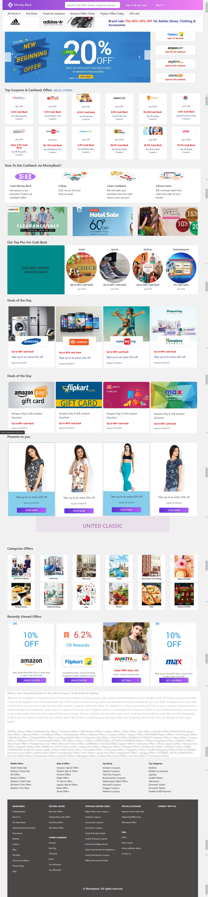

<h1 align="center">static-site</h1>

  <h3>
    <a href="https://venky-cs.github.io/static-site/"> 
      Demo
    </a>
     | 
    <a href="https://github.com/venky-cs/static-site"> 
      Solution
    </a>
  </h3>

## Table of Contents

- [Overview](#overview)
  - [Built With](#built-with)
- [Features](#features)

<!-- OVERVIEW -->

## Overview

  
  

### Built With

<!-- This section should list any major frameworks that you built your project using. Here are a few examples.-->

-HTML
-CSS
-Bootstrap
